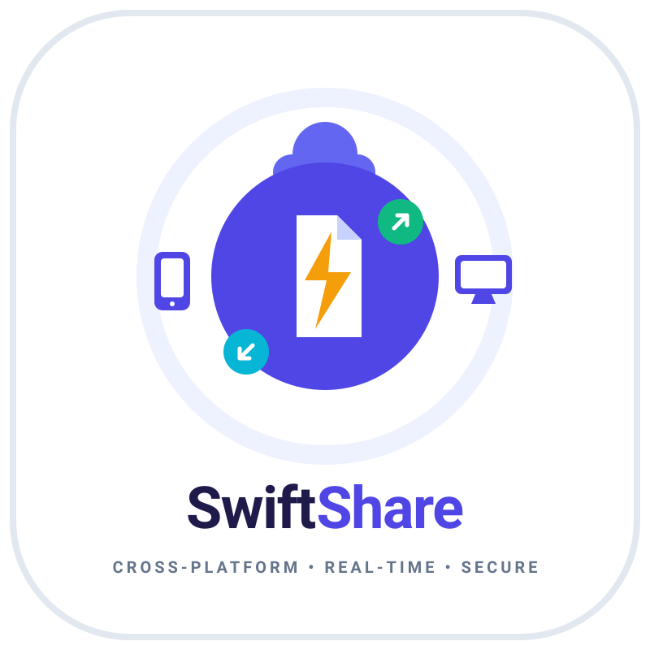
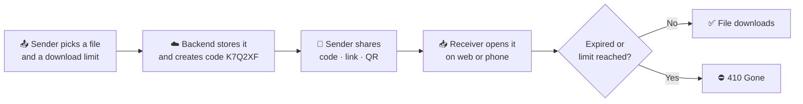
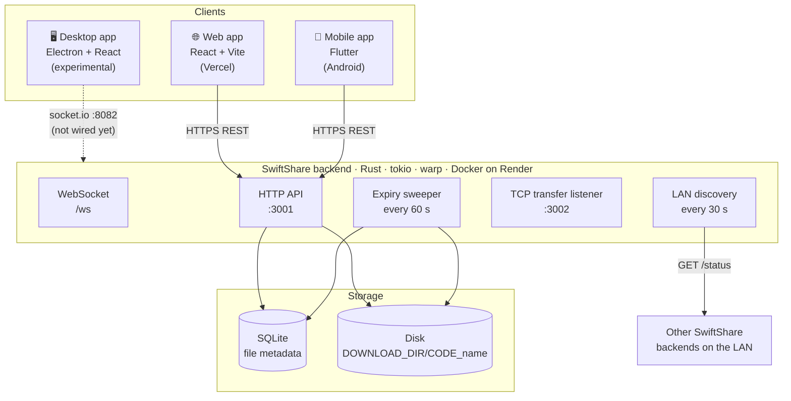
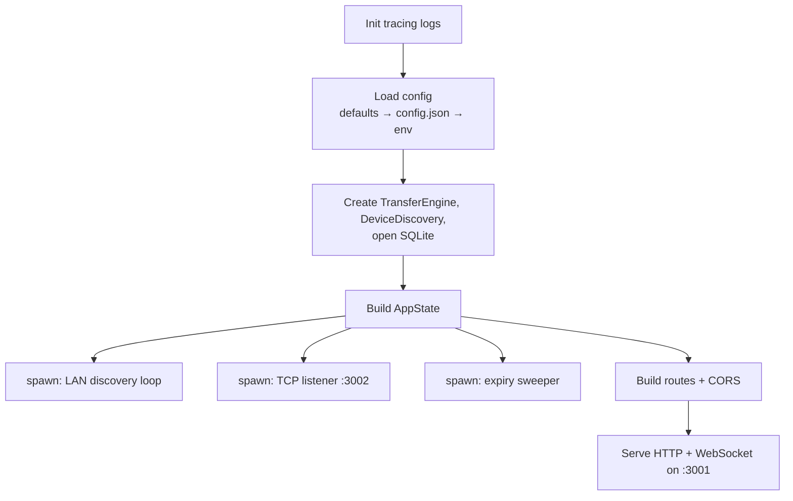
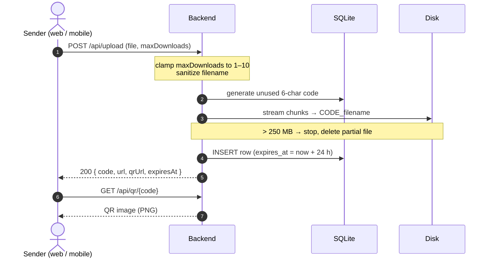
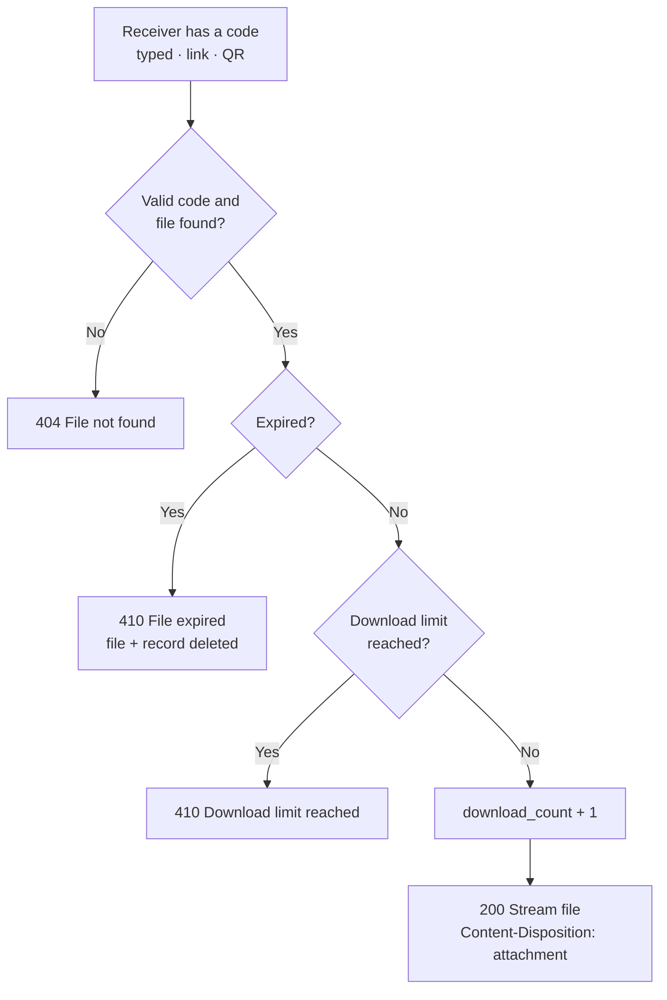
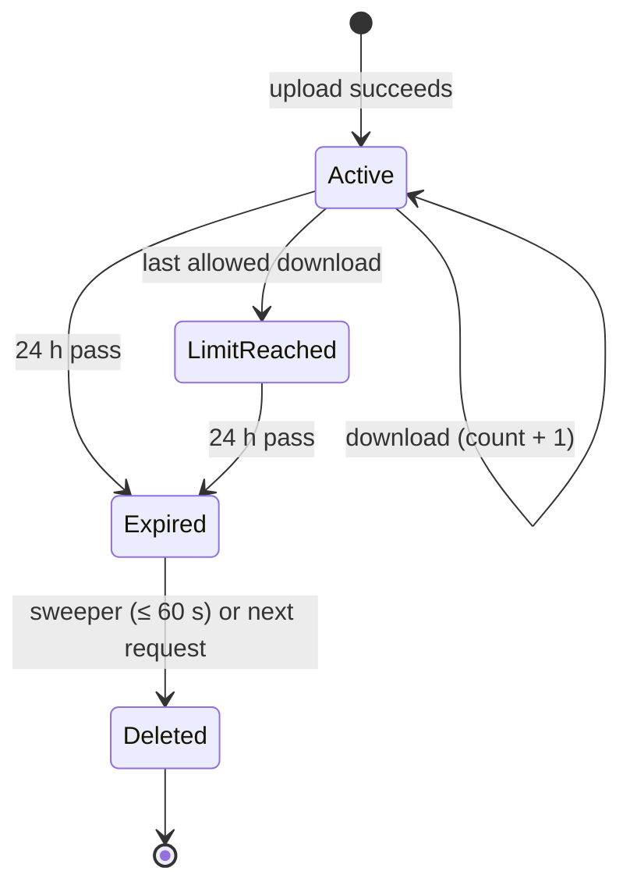
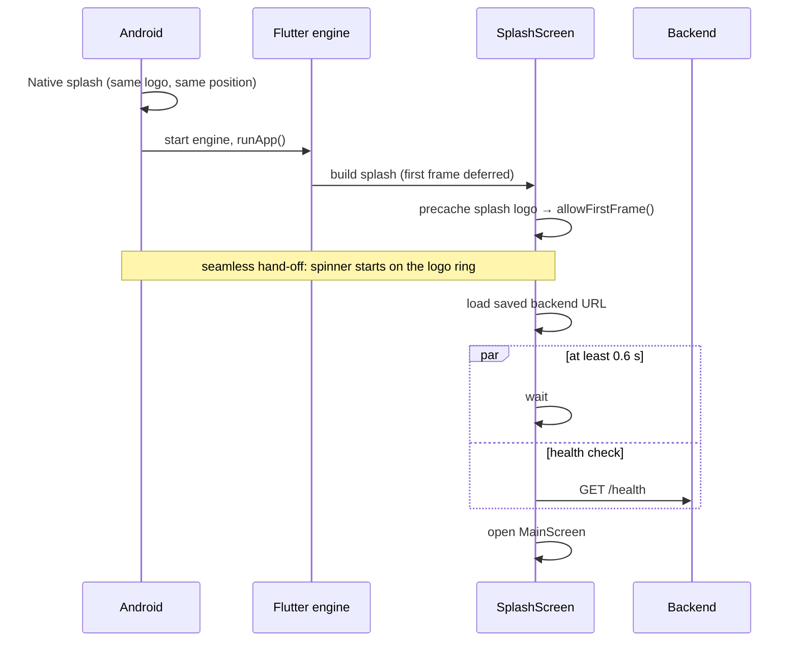
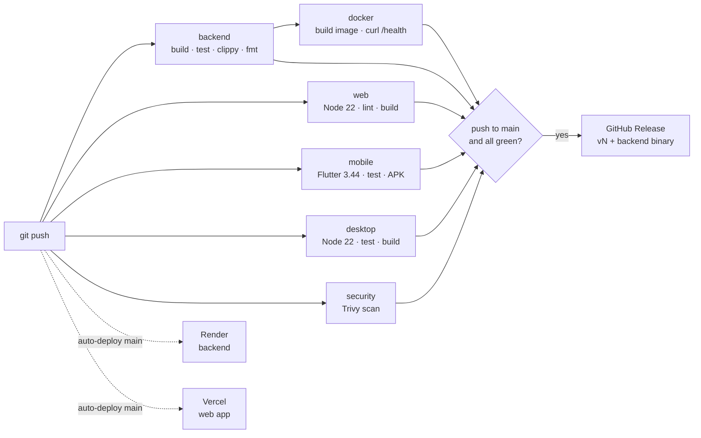

<div align="center">



# SwiftShare

**Send a file. Share a code. No account needed.**

Upload a file from the web or your phone, get a 6-character code, a link and a QR code,
and let anyone download it until the link expires.

[](https://github.com/AyushPandey510/SwiftShare/actions/workflows/ci.yml)


[**Live web app**](https://swift-share-tau.vercel.app) ·
[**Download Android APK**](https://github.com/AyushPandey510/SwiftShare/releases) ·
[API](#-api-reference) ·
[Architecture](#-architecture) ·
[Report a bug](https://github.com/AyushPandey510/SwiftShare/issues)

</div>

---

## 📑 Table of contents

- [Overview](#-overview)
- [Features](#-features)
- [Project status](#-project-status)
- [How it works](#-how-it-works)
- [Architecture](#-architecture)
- [Core flows](#-core-flows)
- [Tech stack](#-tech-stack)
- [Repository structure](#-repository-structure)
- [Getting started](#-getting-started)
- [Configuration](#-configuration)
- [API reference](#-api-reference)
- [Mobile app](#-mobile-app)
- [Deployment](#-deployment)
- [CI/CD](#-cicd)
- [Testing and quality checks](#-testing-and-quality-checks)
- [Security and limits](#-security-and-limits)
- [Troubleshooting](#-troubleshooting)
- [Roadmap](#-roadmap)
- [Contributing](#-contributing)
- [License](#-license)

---

## 🔎 Overview

SwiftShare is a temporary file-sharing service with three clients and one backend:

| Part | What it is | Where it runs |
|---|---|---|
| **Backend** | Rust API that stores files, issues share codes, enforces expiry and download limits | Docker on [Render](https://render.com) |
| **Web app** | React site to upload and download files | [Vercel](https://vercel.com) → [swift-share-tau.vercel.app](https://swift-share-tau.vercel.app) |
| **Mobile app** | Flutter app for Android with upload, download and QR scanning | Android APK |
| **Desktop app** | Electron + React client | Local only (experimental) |

A sender uploads a file and receives a **code** (e.g. `K7Q2XF`), a **link** and a **QR code**.
The receiver enters the code, opens the link, or scans the QR code on any device, and the file downloads until it **expires (24 h)** or reaches its **download limit (1–10)**.

---

## ✨ Features

- **No sign-up**: share anonymously in seconds.
- **Three ways to receive**: 6-character code, direct link, or QR code.
- **Self-destructing shares**: every file expires after 24 hours or after N downloads (sender picks 1–10).
- **Cross-platform**: the same share works between web, Android and desktop.
- **QR scanner** in the mobile app that understands codes, download links and `/access?code=` links.
- **Streaming uploads and downloads**: files are streamed to and from disk, never held fully in memory.
- **Automatic cleanup**: a background job deletes expired files every 60 seconds.
- **LAN mode (experimental)**: discovers other SwiftShare backends on the same Wi-Fi network.
- **Share text**: the web app can share pasted text as a file.

---

## 🚦 Project status

| Component | Status | Notes |
|---|---|---|
| Backend – share by code | ✅ Production | Upload, lookup, download, QR, expiry, limits |
| Web app | ✅ Production | Live on Vercel |
| Android app | 🟡 Beta | Debug-signed APK; Play Store release pending |
| iOS app | ⛔ Not started | No `ios/` project yet |
| Desktop app | 🧪 Experimental | Talks to `localhost:8082` over socket.io, which the backend doesn't serve yet |
| LAN device transfer | 🧪 Experimental | Discovery works on bare-metal installs; transfers are stored on the local backend, not forwarded to the peer |
| Real-time events (WebSocket) | 🧪 Experimental | `/ws` accepts connections; clients don't subscribe yet |

---

## 🧭 How it works



---

## 🏗 Architecture



### Backend modules

| Module | Responsibility |
|---|---|
| `main.rs` | Boot sequence, route table, upload/download/QR/transfer handlers, WebSocket, expiry sweeper |
| `config.rs` | Defaults → `config.json` → environment variables; builds the CORS allow-list |
| `database.rs` | SQLite (`sqlx`) tables: `uploaded_files`, `transfers`, `devices` |
| `discovery.rs` | Subnet scan on port 3001, device list, stale-device cleanup (mDNS is stubbed) |
| `transfer.rs` | TCP listener on port 3002 and in-memory transfer progress |
| `qr.rs` | PNG QR codes for share links |
| `encryption.rs` | AES-GCM helpers (not yet used by the upload path) |

### Backend boot sequence



---

## 🔁 Core flows

### Share (upload)



### Access (download)



The web `/access?code=…` page and the mobile Access screen first call `GET /api/file/{code}` to show the name, size, expiry and downloads left, then download.

### Lifecycle of a shared file



### Mobile app startup



---

## 🧰 Tech stack

| Layer | Technology |
|---|---|
| Backend | Rust (stable), tokio, warp 0.3, sqlx 0.7 (SQLite), qrcode, aes-gcm, tracing |
| Web | React 18, TypeScript, Vite 5, Tailwind CSS, shadcn/ui (Radix), TanStack Query, React Router |
| Mobile | Flutter 3.44 / Dart 3.12, Provider, http, file_picker, mobile_scanner, qr_flutter, shared_preferences |
| Desktop | Electron 28, React (CRA), Zustand, Tailwind |
| Infra | Docker, Render (backend), Vercel (web), GitHub Actions, Trivy |

---

## 📁 Repository structure

```text
SwiftShare/
├── backend/                 # Rust API server
│   ├── src/                 # main.rs, config.rs, database.rs, discovery.rs, transfer.rs, qr.rs, encryption.rs
│   └── Cargo.toml
├── web-frontend/            # React + Vite web app (deployed to Vercel)
│   ├── src/
│   │   ├── components/      # Navbar, Footer, QuickUpload, shadcn/ui
│   │   ├── pages/           # Index, AccessFilePage, UseCasePage, legal pages
│   │   └── lib/api.ts       # backend client
│   ├── public/              # favicon, icons, og-image, logo, site.webmanifest
│   ├── Dockerfile, nginx.conf
│   └── .env.example
├── mobile/                  # Flutter app (Android + Flutter web)
│   ├── lib/                 # config/, models/, providers/, screens/, services/, utils/, widgets/
│   ├── android/             # launcher icons, native splash (values-v31), Gradle config
│   └── assets/images/       # splash logo (1x–4x)
├── desktop/                 # Electron + React desktop client (experimental)
├── shared/
│   ├── brand/               # logo, mark, favicon, app-icon sources (SVG + PNG)
│   └── types.ts             # shared TypeScript types
├── docs/                    # additional guides
├── .github/workflows/ci.yml # CI/CD pipeline
├── Dockerfile               # backend image (used by Render and docker-compose)
├── docker-compose.yml       # local full stack: backend + web
├── render.yaml              # Render blueprint for the backend
└── vercel.json              # Vercel config for the web app
```

---

## 🚀 Getting started

### Prerequisites

| Tool | Version | Needed for |
|---|---|---|
| [Rust](https://rustup.rs) | stable (1.83+) | backend |
| [Node.js](https://nodejs.org) | 22 LTS | web, desktop |
| [Flutter](https://docs.flutter.dev/get-started/install) | 3.44 (Dart 3.12) | mobile |
| Android SDK + JDK 17 | latest | building the APK |
| [Docker](https://docs.docker.com/get-docker/) | 24+ | optional, full stack in containers |

> **Flutter version matters.** `mobile/pubspec.lock` needs Dart ≥ 3.11 / Flutter ≥ 3.38.1. Keep your local Flutter and `flutter-version` in `.github/workflows/ci.yml` in sync.

### 1. Clone

```bash
git clone https://github.com/AyushPandey510/SwiftShare.git
cd SwiftShare
```

### 2. Run the backend

```bash
cd backend
cargo run
# → API on http://localhost:3001  ·  health check: curl http://localhost:3001/health
```

### 3. Run the web app

```bash
cd web-frontend
cp .env.example .env         # leave VITE_API_BASE_URL empty to use <your-host>:3001 in dev
npm ci
npm run dev
# → http://localhost:5173
```

### 4. Run the mobile app

```bash
cd mobile
flutter pub get
flutter run --dart-define=BACKEND_URL=http://<your-computer-LAN-IP>:3001
```

Without `BACKEND_URL` the app uses the hosted backend (`https://swiftshare-e4dh.onrender.com`). The backend URL can also be changed in **Settings** inside the app.

### 5. Run the desktop app (experimental)

```bash
cd desktop
npm ci
npm run electron-dev
```

### Alternative: whole stack with Docker Compose

```bash
docker compose up --build -d
```

| Service | URL |
|---|---|
| Backend API | http://localhost:3001 |
| TCP transfer port | localhost:3002 |
| Web app | http://localhost:8081 |

Files and the database are kept in the `swiftshare-downloads` and `swiftshare-data` volumes, so they survive restarts. `docker compose down -v` deletes them.

---

## ⚙️ Configuration

### Backend

Settings are read in this order, each overriding the previous: built-in defaults → `<config dir>/swiftshare/config.json` → environment variables.

| Variable | Default | Description |
|---|---|---|
| `PORT` / `API_PORT` | `3001` | HTTP API port (`PORT` is what Render sets) |
| `TRANSFER_PORT` | `3002` | TCP port for LAN transfers |
| `BIND_ADDRESS` | `0.0.0.0` | Interface to listen on |
| `PUBLIC_BASE_URL` | `http://localhost:<port>` | Public URL used in share links and QR codes. **Must be set in production.** |
| `CORS_ALLOWED_ORIGINS` | – | Extra allowed origins, comma-separated (the Vercel domain and localhost dev ports are built in) |
| `DOWNLOAD_DIR` | `~/Downloads/SwiftShare` | Where uploaded files are stored |
| `DATABASE_PATH` | `~/.local/share/swiftshare/swiftshare.db` | SQLite database file |
| `MAX_FILE_SIZE` | `262144000` (250 MB) | Upload size limit in bytes |
| `BUFFER_SIZE` | – | Transfer buffer size in bytes |
| `RUST_LOG` | – | Log level, e.g. `info`, `debug` |
| `SWIFTSHARE_SCAN_IN_CONTAINER` | `false` | Enable LAN scanning inside Docker |

### Web app

| Variable | Description |
|---|---|
| `VITE_API_BASE_URL` | Backend URL, baked in at **build** time. Set it in Vercel → Settings → Environment Variables, then redeploy. Empty = `<current host>:3001` in dev, `http://localhost:3001` in production builds. |

### Mobile app

| Setting | How |
|---|---|
| Backend URL | `--dart-define=BACKEND_URL=https://…` at build time, or **Settings → Backend URL** in the app |

---

## 📡 API reference

Base URL: `https://swiftshare-e4dh.onrender.com` (production) or `http://localhost:3001` (local).
All JSON responses use `{ "success": true, "data": … }` or `{ "success": false, "error": "…" }`.

| Method | Path | Description |
|---|---|---|
| `GET` | `/health` | Liveness check |
| `GET` | `/status` | Device name, version, ports, capabilities |
| `POST` | `/api/upload` | Upload a file (multipart: `file`, `maxDownloads`) |
| `GET` | `/api/file/{code}` | File details for a code |
| `GET` | `/api/download/{code}` | Download the file (counts toward the limit) |
| `GET` | `/api/qr/{code}` | QR code image for the share link |
| `GET` | `/api/devices` | Devices found on the LAN |
| `POST` | `/api/transfer` | Send a file to a LAN device (experimental) |
| `GET` | `/api/transfer/{id}` | Transfer status |
| `GET` | `/api/transfers` | Transfer history |
| `GET` | `/ws` | WebSocket upgrade (experimental) |

<details>
<summary><b>Upload a file</b></summary>

```bash
curl -F "file=@report.pdf" -F "maxDownloads=3" http://localhost:3001/api/upload
```

```json
{
  "success": true,
  "data": {
    "id": "5f0c…",
    "code": "K7Q2XF",
    "filename": "report.pdf",
    "size": 482113,
    "type": "application/pdf",
    "url": "http://localhost:3001/api/download/K7Q2XF",
    "qrUrl": "http://localhost:3001/api/qr/K7Q2XF",
    "expiresAt": "2026-09-28T10:15:00+00:00",
    "downloadCount": 0,
    "maxDownloads": 3,
    "uploadedAt": "2026-09-27T10:15:00+00:00",
    "uploadedBy": "guest"
  }
}
```
</details>

<details>
<summary><b>Look up and download</b></summary>

```bash
curl http://localhost:3001/api/file/K7Q2XF          # details
curl -OJ http://localhost:3001/api/download/K7Q2XF  # saves report.pdf
```
</details>

<details>
<summary><b>Status codes</b></summary>

| Code | When |
|---|---|
| `200` | Success. Note: an upload that goes over the limit **while streaming** also returns 200 with `success: false` |
| `404` | Unknown or invalid code, route not found |
| `405` | Wrong HTTP method |
| `410` | File expired, or download limit reached |
| `411` | `Content-Length` missing on upload |
| `413` | Declared upload size over `MAX_FILE_SIZE` |
| `415` | Wrong content type (upload must be `multipart/form-data`) |
</details>

---

## 📱 Mobile app

### Build a release APK

```bash
cd mobile
flutter build apk --release --split-per-abi \
  --obfuscate --split-debug-info=build/symbols \
  --dart-define=BACKEND_URL=https://swiftshare-e4dh.onrender.com
```

Share `build/app/outputs/flutter-apk/app-arm64-v8a-release.apk` (fits almost every modern phone). Keep `build/symbols` to decode crash stack traces.

For Google Play, build an app bundle instead:

```bash
flutter build appbundle --release --dart-define=BACKEND_URL=https://swiftshare-e4dh.onrender.com
```

### Before publishing to Google Play

- [ ] Change `applicationId` / `namespace` from `com.example.swiftshare_mobile` in `android/app/build.gradle.kts`.
- [ ] Create an upload keystore and sign release builds with it (they are debug-signed today).
- [ ] Set `android:usesCleartextTraffic="false"` in `AndroidManifest.xml`.
- [ ] Add a privacy policy URL (the app uses the camera for QR scanning).

### Keeping the APK small

| Step | Effect |
|---|---|
| Release build with `--split-per-abi` | ~104 MB debug APK → roughly 10–20 MB per ABI |
| `isMinifyEnabled` + `isShrinkResources` in the release build type | Removes unused Java/Kotlin code and resources |
| `--obfuscate --split-debug-info` | Moves Dart debug info out of the APK |
| `dev.steenbakker.mobile_scanner.useUnbundled=true` in `gradle.properties` | Uses the Play Services barcode model instead of bundling it |
| Remove unused packages (`sqflite`, `riverpod`, `lottie`, `flutter_svg`, `cupertino_icons`) | Less native code, faster builds |

Measure with `flutter build apk --release --target-platform android-arm64 --analyze-size`.

---

## ☁️ Deployment

| Target | Source | Config | Notes |
|---|---|---|---|
| **Backend** | root `Dockerfile` | `render.yaml` + Render env vars | Set `PUBLIC_BASE_URL`. Attach a persistent disk at `/app/data` and `/app/downloads`, otherwise files are lost on every restart |
| **Web** | `web-frontend/` | `vercel.json` | Set `VITE_API_BASE_URL` in Vercel |
| **Android** | `mobile/` | see [Mobile app](#-mobile-app) | APK attached to GitHub Releases; Play Store planned |

> ⚠️ **Render free plan:** no persistent disk, and the service sleeps after 15 minutes without traffic. Every restart or spin-down deletes all shared files. Use a paid instance with a disk, or move file storage to S3 / Cloudflare R2 (see [Roadmap](#-roadmap)).

---

## 🔄 CI/CD

Every push to `main` or `develop` and every pull request to `main` runs `.github/workflows/ci.yml`.



Render and Vercel deploy from `main` on their own. To stop a failing build from reaching production, set Render's auto-deploy to **"After CI checks pass"**.

---

## ✅ Testing and quality checks

Run these before opening a pull request. CI runs the same ones.

```bash
# Backend
cd backend && cargo fmt -- --check && cargo clippy && cargo test

# Web
cd web-frontend && npm run lint && npm run build

# Mobile
cd mobile && flutter analyze && flutter test

# Desktop
cd desktop && npm test -- --watchAll=false && npm run build
```

---

## 🔐 Security and limits

| Topic | Current behaviour |
|---|---|
| File size | 250 MB per upload (`MAX_FILE_SIZE`) |
| Expiry | 24 hours after upload, fixed |
| Download limit | 1–10, chosen by the sender, enforced on the server |
| Share codes | 6 characters, A–Z and 0–9 |
| Storage | Files are stored unencrypted on the server disk |
| Transport | HTTPS in production (Render and Vercel) |
| CORS | Allow-list: Vercel domain, localhost dev ports, `CORS_ALLOWED_ORIGINS` |
| Uploads | Filenames are reduced to their base name; downloads are sent as attachments with `X-Content-Type-Options: nosniff` |

**Known gaps** (tracked in the roadmap): no rate limiting on code lookups, no malware scanning, and the download-count check is not atomic under parallel requests.
Found a vulnerability? Please open a private security advisory on GitHub instead of a public issue.

---

## 🩺 Troubleshooting

<details>
<summary><b>CI: <code>The current Dart SDK version is 3.9.0 … version solving failed</code></b></summary>

CI is installing an older Flutter than your lockfile needs. Set `flutter-version` in `.github/workflows/ci.yml` to your local version (`flutter --version`), currently `3.44.0`.
</details>

<details>
<summary><b>Web app: CORS error in the browser console</b></summary>

Your site's domain isn't allowed by the backend. Add it to `CORS_ALLOWED_ORIGINS` on Render (comma-separated, no trailing slash) and redeploy.
</details>

<details>
<summary><b>Share links point to <code>localhost</code></b></summary>

`PUBLIC_BASE_URL` isn't set on the backend. Set it to the public backend URL, e.g. `https://swiftshare-e4dh.onrender.com`.
</details>

<details>
<summary><b>Shared files disappear</b></summary>

The backend's disk is temporary (Render free plan). See [Deployment](#-deployment).
</details>

<details>
<summary><b>First request is very slow</b></summary>

The Render free instance was asleep. It takes roughly a minute to wake up.
</details>

<details>
<summary><b>Mobile app can't reach a local backend</b></summary>

Use your computer's LAN IP, not `localhost`, e.g. `--dart-define=BACKEND_URL=http://192.168.1.20:3001`, and make sure the phone is on the same Wi-Fi.
</details>

<details>
<summary><b>Mobile app: slow start or blank screen in debug</b></summary>

Debug builds start much slower than release builds. Check startup with `flutter run --release`.
</details>

---

## 🗺 Roadmap

- [ ] **Object storage**: direct-to-S3 / R2 uploads with presigned multipart URLs (larger files, no disk limits, resumable)
- [ ] Graceful shutdown and atomic download counting
- [ ] Rate limiting and abuse reporting; malware scanning
- [ ] End-to-end encryption (key in the link's `#fragment`)
- [ ] Choose expiry (1 h / 24 h / 7 days) and optional password
- [ ] Multiple files / folders under one code
- [ ] "Share to SwiftShare" from other Android apps; native share sheet
- [ ] Download notifications for the sender over WebSocket
- [ ] Google Play release; iOS app
- [ ] Desktop app wired to the REST API
- [ ] Real LAN peer-to-peer transfers and mDNS discovery
- [ ] Pro plan (bigger files, longer expiry, custom links)

---

## 🤝 Contributing

1. Fork the repo and create a branch: `git checkout -b feat/short-description`.
2. Make your change and run the [quality checks](#-testing-and-quality-checks).
3. Use clear commit messages, e.g. `feat(web): add expiry picker`, `fix(backend): atomic download count`.
4. Open a pull request to `main` describing **what** changed and **why**, with screenshots for UI changes.

Bug reports and feature requests are welcome in [Issues](https://github.com/AyushPandey510/SwiftShare/issues).

---

## 📄 License

Released under the [MIT License](LICENSE).

---

<div align="center">

Built by **Ayush Pandey** ·
[GitHub](https://github.com/AyushPandey510) ·
[LinkedIn](https://www.linkedin.com/in/ayush-pandey-097027242/) ·
[X](https://x.com/AyushPande28353)

</div>
